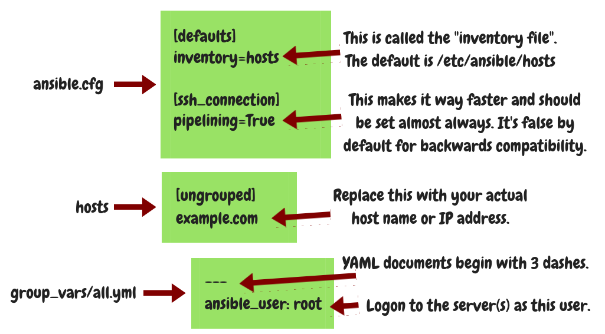

============================================
Day 2: Connecting to the server with Ansible
============================================

Yesterday:

 * You installed Ansible on your local machine
 * You created a Ubuntu 22.04 server that you will control with Ansible,
   and to which you can logon with your ssh keys
 * You created a quicksearch to the Ansible library reference in your browser
 * You got a quick idea of greeter, a silly Django application that we
   will be deploying as an example

Create a repository
===================

First, create a repository for your Ansible code:

.. code-block:: bash

   mkdir greeter-ansible
   cd greeter-ansible
   git init
   echo '*.retry' >.gitignore

Configure Ansible
=================

We will create the three files that I'm showing in the image below.
Please go ahead and create them inside your working directory.

When we execute Ansible, first it's going to read ``ansible.cfg`` from
the current directory. In there, it finds the information that the list
of hosts, the **inventory file** as it's called, is in file ``hosts``.
The name of the file that defines the variables, ``group_vars/all.yml``
is hardwired in Ansible, it's going to read that one anyway. From there
it's going to get the information that it should be logging in as root
on all remote servers. Here we have only one remote server.

Check the connection and debug it
=================================

Let's check the connection. Please execute this command:

Here are possible errors you may encounter:

 1. ERROR! Unexpected Exception: dictionary update sequence element #0 has length 1; 2 is required
 2. ERROR! Problem parsing file '.../greeter-ansible/group_vars/all.yml': line 2, column 1
 3. ERROR! failed to combine variables, expected dicts but got a 'dict' and a 'AnsibleUnicode': 
 4. SSH Error: data could not be sent to remote host "example.com". Make sure this host can be reached over ssh
 5. /usr/bin/python: not found (message slightly buried in details of Ansible output)

The first three error messages are caused by a common error beginners
do: in file ``group_vars/all.yml``, you may have forgotten a space after
the colon. In this case, which error message will appear depends on the
version of Ansible.

If you get the fourth message, make sure you can SSH into the server.
Remember that in ``group_vars/all.yml`` we have specified that the
ansible will be logging into the server as root; so you should make
certain that ``ssh root@example.com`` works without asking for a
password.

If you get the fifth message, it means that Python isn't installed on
the server. Ansible logs on to the remote server and it executes Python
on the remote server. To fix this problem, you need to ssh into the
remote server and execute ``apt install python3``.

So before running Ansible we must first bring the servers to a state
where running Ansible is possible, which means they must be running
Python and an ssh server. If you try the ping command again this time it
should succeed. Essentially all this does is verify that Ansible can ssh
and execute Python remotely, which means Ansible is ready to do more
stuff.

Tomorrow we will create our first playbook.
