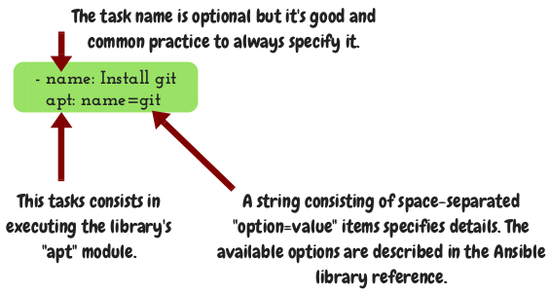

=================================
Day 3: Playbooks, plays and tasks
=================================

Yesterday:
 * You created a repository and added the three files ``ansible.cfg``,
   ``hosts``, and ``group_vars/all.yml`` to the working directory. 
 * You tested and troubleshooted Ansible's connection to the server. 

Today you will create and execute your first playbook.
  
Create the playbook
===================

The playbook is essentially the script we use to install the server.
Create a file ``site.yml`` in your working directory with these
contents: 

.. code-block:: yaml

   ---
   - name: Install greeter server
     hosts: example.com
     tasks:
      - name: Install git
        apt: name=git

      - name: Install virtualenv
        apt: name=virtualenv

      - name: Install nginx
        apt: name=nginx-light

      - name: Install pillow
        apt: name=python3-pillow

You need to replace ``example.com`` with the actual name of your server
(the one you have specified in the ``hosts`` file).

This is a playbook that consists of a **single play**, which consists of
**four tasks**. We could add another play below it, but in this course
we will only deal with a single play.
  
Execute the playbook
====================

Next, enter this command to execute the playbook: 

.. code-block:: bash

   ansible-playbook site.yml

When you do this, Ansible logs on to the server and executes the tasks
we specified in the playbook. The output is green for the tasks that had
already been accomplished, and orange for those tasks for which the
execution resulted in a modification of the server. Try running the
command a second time to see the difference. So when you run the
playbook on a server that is already setup, you should get no orange
output, and in the end, when Ansible shows the summary of what it did,
the "changed" part should be zero.
 
Anatomy of a task
=================

Ansible has a library of modules. In contrast to Python, each Ansible
module is just one command, a directive let's say. And each directive
accepts options. So the only option we are specifying here in the
``apt`` task is ``name`` (I'm talking about the ``name=git`` option in
the ``apt`` line, not about the name of the task). If you created a
shortcut on your browser as I told you two days ago, you should be able
to visit the reference for the ``apt`` module very easily, so please do
that and take a quick look at the page.
  
Your turn
=========

Here is your assignment for tomorrow: 

 * Create a fifth task that will create a user. 
 * The task must do the equivalent of this command:

   .. code-block:: bash

      adduser --system --home=/var/opt/greeter \
         --no-create-home --disabled-password --group \
         --shell=/bin/bash greeter

 * Use the ansible ``user`` module. 
 * Ignore ``--disable-password`` and ``--group``, as this is the default
   behavior of the module. 
 * Execute the playbook with ``ansible-playbook site.yml``. 

Don't spend more than 5–10 minutes for it.

Tomorrow we will discuss the solution to this assignment and we will see
three more examples of Ansible library modules.
