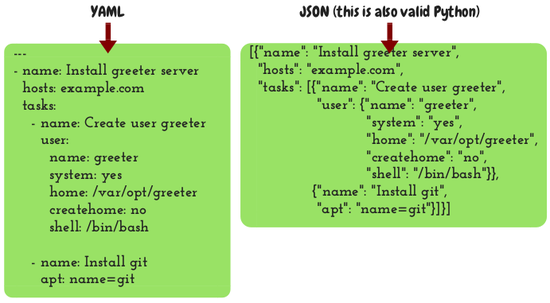

==============================
Day 4: YAML, git, pip, command
==============================

Yesterday I gave you this assignment:

 * Create a fifth task that will create a user. 
 * The task must do the equivalent of this command: 

   .. code-block:: bash

      adduser --system --home=/var/opt/greeter \
      --no-create-home --disabled-password --group \
      --shell=/bin/bash greeter

 * Use the ansible ``user`` module. 
 * Ignore ``--disable-password`` and ``--group``, as this is the default
   behavior of the module. 
 * Execute the playbook with ``ansible-playbook site.yml``. 

Here is the solution: 

.. code-block:: yaml

   - name: Create user greeter
     user: name=greeter system=yes home=/var/opt/greeter createhome=no shell=/bin/bash

But usually we write long stuff like this:

.. code-block:: yaml

   - name: Create user greeter
     user:
        name: greeter
        system: yes
        home: /var/opt/greeter
        createhome: no
        shell: /bin/bash

So now please change what you've written so that it looks like in the second form.
 
YAML
====

The language in which we are writing all that is YAML, pronounced yamel;
it means "Yet Another Markup Language". It's a data description
language. Pretty much everything you can do in JSON you can do in YAML
and vice versa. YAML is a bit more versatile I think but it doesn't
matter. The thing is it's more readable. You don't need to program
Ansible in YAML, you can program it in JSON. You can change the language
backend in Ansible, pretty much in the same way that you can change the
template engine in Django. However pretty much everyone writes YAML in
Ansible so don't use anything else. This picture, that shows the same
thing written in YAML and JSON, should make it clear how YAML works:

One thing you can notice is that in YAML you don't need to quote
strings. YAML does support different data types such as numbers, but
"Install greeter server" can't be a number, so YAML assumes it's a
string. It's not an error to quote it however, and sometimes it is
necessary. We'll see more about this later.
  
Git and pip
===========

Here is another assignment for you:

Create two tasks that will clone the repository, create a virtualenv,
and install requirements. The tasks must do the equivalent of these
commands: 

.. code-block:: bash

   cd /opt
   git clone https://github.com/djangodeployment/greeter.git
   virtualenv --system-site-packages \
     --python=/usr/bin/python3 /opt/greeter/venv
   source /opt/greeter/venv/bin/activate
   pip install -r /opt/greeter/requirements.txt

Hints: 
 * Use the ansible ``git`` module for cloning 
 * Use the ansible ``pip`` module for the virtualenv and requirements 

You should spend about 10 minutes. Scroll down to see the answer:

⇓

⇓

⇓

⇓

⇓

⇓

⇓

⇓

⇓

⇓

⇓

⇓

⇓

⇓

⇓

⇓

⇓

⇓

⇓

⇓

⇓

⇓ 

Here is the answer:

.. code-block:: yaml

   - name: Install greeter
     git:
       repo: https://github.com/djangodeployment/greeter.git
       dest: /opt/greeter
       version: production
   - name: Install greeter prerequisites
     pip:
       requirements: /opt/greeter/requirements.txt
       virtualenv: /opt/greeter/venv
       virtualenv_python: python3
       virtualenv_site_packages: yes

You should have written more or less the same thing, except that I have
added the ``version`` option to git. I have created a tag that I call
``production`` in the greeter repository.  If you don't specify the
``version`` option, by default it checks out the master branch, which is
probably not what you want on your production machine. In other projects
you might want to specify a version number instead, but anyway you are
probably always going to want to specify the version in some way.
  
The "command" module
====================

The problem we have now is that we aren't going to be running the Django
application as ``root`` or as ``www-data``; we have created a user for
running the application and Django is going to be running as that user,
so it's not going to be able to compile the files in ``/opt/greeter``,
because that directory belongs to root. What we will do is we will
precompile the files, and in order to precompile them we need to execute
this command: 

.. code-block:: bash

   /opt/greeter/venv/bin/python -m compileall \
      -x ^/opt/greeter/venv/ /opt/greeter

So you next assignment is to create a task that will execute this
command. Use the Ansible ``command`` module for that. It should take you
less than 5 minutes. Scroll down to see the answer.

⇓

⇓

⇓

⇓

⇓

⇓

⇓

⇓

⇓

⇓

⇓

⇓

⇓

⇓

⇓

⇓

⇓

⇓

⇓

⇓

⇓

⇓

Here is the answer: 

.. code-block:: yaml

   - name: Compile greeter
     command: >
       /opt/greeter/venv/bin/python -m compileall
       -x ^/opt/greeter/venv/ /opt/greeter

I'm showing you a useful YAML idiom here. If you use the greater-than
sign, it just takes all the following indented lines and combines them
into one line, that is, it removes the newlines.
  
Executing "command" only when we need
=====================================

Now the problem is that if you try executing the playbook again, the
result of the ``command`` task is going to be orange. You just tell it
to execute this command, and it has no way of knowing whether it should
or should not execute the command, and it executes it every time.

There are two ways to go around this. One is to always execute it and
add an Ansible option that tells it to not account it as changed. This
is a valid option, because Python's ``compileall`` actually does check
whether it needs to compile each individual file (I think it uses the
file timestamps for that). So it's no problem if we run the command each
time. The problem is essentially cosmetic, because each time we execute
our playbook this task is going to be reported as "changed". You don't
want that, because your playbook will eventually grow to hundreds of
tasks, and then you will make a change and execute the playbook on your
servers and look at the summary and say "hey, I was expecting only one
task to be marked as changed and I have two, or three, why is that?" and
you will be wasting your time searching the backlog to see why.  So it's
not just cosmetic, it's actually important.  But because in essence
Python's ``compileall`` can be harmlessly executed each time, it would
be a valid solution to execute it each time and use an Ansible option
that says "always report this particular task as not changed". Such an
option exists (it's called ``changed_when``), but we are not going to
use it here.

We are going to do it in a different way. We will convert this task to a
handler. But that's enough for today. We'll continue with handlers
tomorrow.
