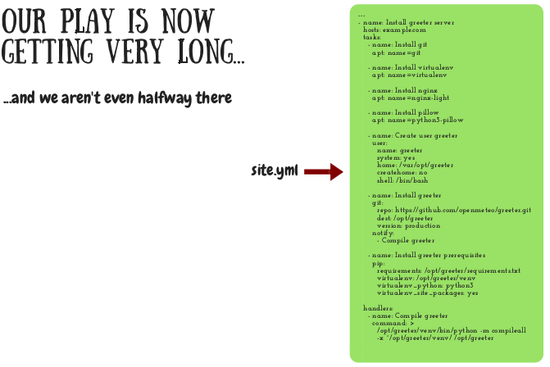
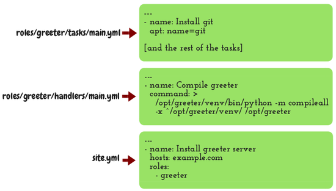
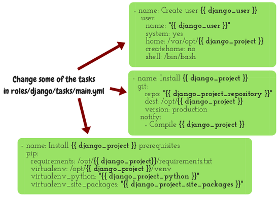

======================
Day 5: Handlers, roles
======================

Yesterday we wrote this task:

.. code-block:: yaml

   - name: Compile greeter
     command: >
       /opt/greeter/venv/bin/python -m compileall
       -x ^/opt/greeter/venv/ /opt/greeter

We discussed that the result of the ``command`` task is always going to
be orange, because Ansible has no way of knowing whether it should or
should not execute the command, and it executes it every time. We said
there are two ways around this, and briefly discussed one possibility to
add an Ansible option that tells it to not account it as changed. This
is a valid option (in this case), but we are going to do it in another
way: we will convert the task to a handler.
  
Handlers
========

Modify your playbook and make it like this:

.. code-block:: yaml

   tasks:
     # [...]

     - name: Install greeter
       git:
         repo: https://github.com/openmeteo/greeter.git
         dest: /opt/greeter
         version: production
       notify:
     - Compile greeter

   handlers:
    - name: Compile greeter
      command: >
        /opt/greeter/venv/bin/python -m compileall
        -x ^/opt/greeter/venv/ /opt/greeter

So now it's event-driven; the compilation is an event triggered by the
execution of another task. If you try executing the playbook now the
handler will not run because the git task will not make any change. You
can try modifying something (such as deleting the /opt/greeter
directory) if you want so that you'll see the handler running, but it's
not necessary—we'll create more handlers later anyway.
  
Roles
=====

We have a long play and we would never actually write it this way.

We wrote it like this for educational purposes, but now we will start
writing it the proper way. We will break it into more files. So please
break it into files as explained on this image:

That is, copy all the tasks to file ``roles/greeter/tasks/main.yml``,
and the handlers to the second file, and reduce the playbook file to
what is shown. After you finish execute the playbook to verify that it
works.

What we have done is we have taken all these tasks and handlers and
converted them to a role. Essentially what it does is it takes the tasks
of the role and executes them and also takes the handlers of the role
and triggers them if needed. So the role is pretty much a kind of an
include statement, it includes the tasks and handlers of the role in the
play.
  
Reusable roles
==============

The roles are good if they are reusable, and the one we've made is not
reusable the way we wrote it. If you want to install another Django
project you would need to create another role and retype essentially the
same things. Instead, we will make this role reusable.
  
Step 1
------

Rename role ``greeter`` to ``django``. All you need to do is rename the
``roles/greeter`` directory.
  
Step 2
------

Change some of the tasks as shown in this picture:

Step 3
------

Change the handler in ``roles/django/handlers/main.py`` and make it like this: 

.. code-block:: yaml

   ---
   - name: Compile {{ django_project }}
     command: >
       /opt/{{ django_project }}/venv/bin/python -m compileall
       -x ^/opt/{{ django_project }}/venv/ /opt/{{ django_project }}
  
Step 4
------

Change the playbook, ``site.yml``, and make it like this: 

.. code-block:: yaml

   ---
   - name: Install greeter server
     hosts: example.com
     roles:
       - role: django
         django_project: greeter
         django_project_repository: https://github.com/djangodeployment/greeter.git
         django_user: greeter
         django_project_python: python3
         django_project_site_packages: yes

Run it
------

Now try running it to see if there are any errors.

An error you might have made here is forget some of the quotes in Step
2. The braces have a special meaning in YAML, so if you don't quote them
the YAML parser will attempt to interpret them.  So we quote them, and
the YAML parser thinks they are strings, and after that parsing is
completed Ansible will give them to the Jinja parser.
  
Improving the installation of apt packages
==========================================

We have four tasks for installing ``apt`` packages:

.. code-block:: yaml

   - name: Install git
     apt: name=git

   - name: Install virtualenv
     apt: name=virtualenv

   - name: Install nginx
     apt: name=nginx-light

   - name: Install pillow
     apt: name=python3-pillow

This way of installing tasks was educational. We would actually not do
it this way. Instead, we would do it like this, which is more elegant
and compact and runs much faster:

.. code-block:: yaml

   - name: Install packages required for django
     apt:
       name:
         - git
         - virtualenv
         - nginx-light
         - python3-pillow

One problem is that the installing of ``python3-pillow`` is specific to
greeter and does not belong in a general, reusable ``django`` role. But
we've gone through enough for one day, so we will solve this problem
tomorrow.
