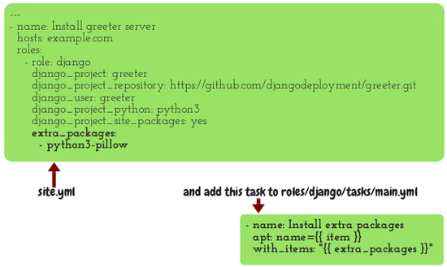
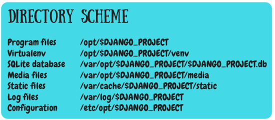

==============================================
Day 6: Loops, "file" module, "template" module
==============================================

Yesterday, when we converted the ``greeter`` role to a reusable
``django`` role, we determined that the installing of ``python3-pillow``
is specific to greeter and does not belong in a general, reusable
``django`` role. There are two solutions to that.
 
Executing extra tasks
=====================

The first solution is very simple. Modify your playbook, ``site.yml``,
and make it like this:

.. code-block:: yaml

   ---
   - name: Install greeter server
     hosts: example.com
     tasks:
       - name: Install extra apt packages for greeter
         apt:
           name:
             - python3-pillow
     roles:
       - role: django
         django_project: greeter
         django_project_repository: https://github.com/djangodeployment/greeter.git
         django_user: greeter
         django_project_python: python3
         django_project_site_packages: yes

You should also remove the Pillow installation from
``roles/django/tasks/main.yml``, if it's still there.

Loops
=====

This is the alternative solution, but we are not going to implement it right now:

I'm just showing it to you so that you get an idea of how we accomplish
loops in Ansible. On the one hand this is better because the
installation of the package goes inside the role definition, which is
logically the correct thing to do. The problem of this solution is that
it is less general. It solves only the problem of installing extra
packages, but maybe some Django project could need something else
besides package installation. You can choose any solution you like, or a
combination. For the moment we will go with the previous solution.

The file module
===============

Before continuing with the file module, let me show the directories we
are using in this course while deploying Django:

It probably looks a bit strange to you. Most people aren't doing this;
instead they are putting all files under a single directory which is
something like ``/home/django`` or ``/srv/django`` perhaps. I prefer to
follow the Filesystem Hierarchy Standard. It's very good for educational
purposes and I also use it because it's very clean, it's convenient for
backup and automation and it can scale.

Now it's time for another assignment. Create three tasks that will
create the data, log, and configuration directories. The tasks must do
the equivalent of these commands:

.. code-block:: bash

   mkdir /var/opt/$DJANGO_PROJECT
   chown $DJANGO_USER /var/opt/$DJANGO_PROJECT
   mkdir /var/log/$DJANGO_PROJECT
   chown $DJANGO_USER /var/log/$DJANGO_PROJECT
   mkdir /etc/opt/$DJANGO_PROJECT
   chgrp $DJANGO_GROUP /etc/opt/$DJANGO_PROJECT
   chmod 750 /etc/opt/$DJANGO_PROJECT

Hint:
 * Use the Ansible ``file`` module

You should spend 5–10 minutes on that. Scroll down to see the answer.

⇓

⇓

⇓

⇓

⇓

⇓

⇓

⇓

⇓

⇓

⇓

⇓

⇓

⇓

⇓

⇓

⇓

⇓

⇓

⇓

⇓

⇓

Here is the answer:

.. code-block:: yaml

   - name: Create data directory /var/opt/{{ django_project }}
     file:
        path: /var/opt/{{ django_project }}
        state: directory
        owner: "{{ django_user }}"

   - name: Create log directory /var/log/{{ django_project }}
     file:
        path: /var/log/{{ django_project }}
        state: directory
        owner: "{{ django_user }}"

   - name: Create config directory /etc/opt/{{ django_project }}
     file:
        path: /etc/opt/{{ django_project }}
        state: directory
        group: "{{ django_user }}"
        mode: 0750

One thing you must be careful about is that the 750 must be preceeded by
a zero. The reason is that the YAML parser interprets this as a number
and in YAML the number is octal if it begins with zero.

You may have noticed here that I'm using a variable that makes the task
name unique.  If you install two Django projects on the same machine you
would use the same role twice, so if you didn't use a variable you would
have two tasks with the same name. This will usually not be a problem in
tasks, but it is a problem with handlers. If a task decides to trigger a
handler, and there are two handlers with the same name, Ansible will not
know which handler is meant. So all handlers must have a variable in
their name if the role might be assigned more than once on a given
machine. I often do this in tasks as well, out of habit.

The template module
===================

Here is another assignment for you. We are going to create
``settings.py``.

Step 1
------

Copy this and put it in file ``roles/django/templates/settings.py.j2``:

.. code-block:: python

   from {{ django_project }}.settings import *

   DEBUG = False
   ALLOWED_HOSTS = ['{{ django_domain }}']
   SECRET_KEY = '{{ django_secret_key }}'
   DATABASES = {
       'default': {
           'ENGINE': 'django.db.backends.sqlite3',
           'NAME': '/var/opt/{{ django_project }}/{{ django_project }}.db',
       }
   }
   STATIC_ROOT = '/var/cache/{{ django_project }}/static/'
   STATIC_URL = '/static/'
   MEDIA_ROOT = '/var/opt/{{ django_project }}/media/'
   MEDIA_URL = '/media/'

Step 2
------

Write another task (in ``roles/django/tasks/main.yml``) that will create
``/etc/opt/greeter/settings.py``, using the Ansible ``templates`` module.

Step 3
------

Expand the compile handler to also compile the configuration directory,
and have the new task notify it.

Step 4
------

Add the ``django_domain`` and ``django_secret_key`` parameters to the
playbook.

Step 5
------

I trust you can do this assignment on your own and I will not give you
the result. Tomorrow we will create two more handlers.
